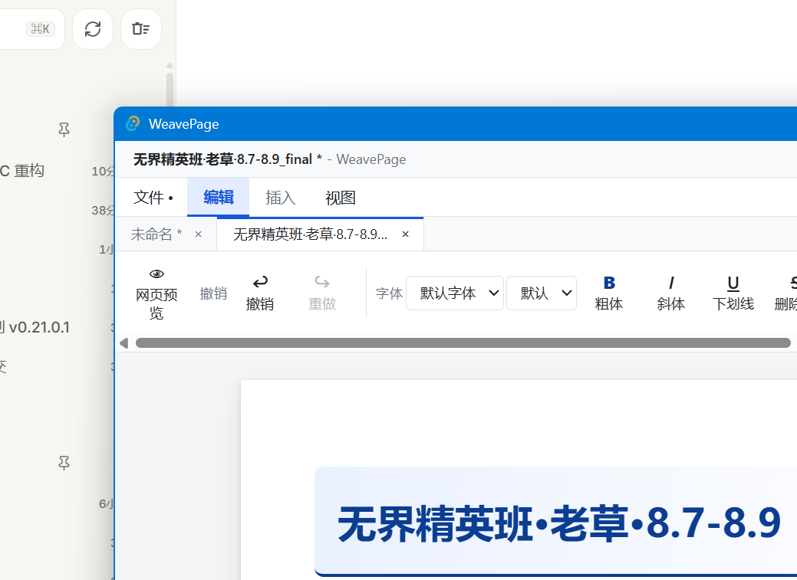
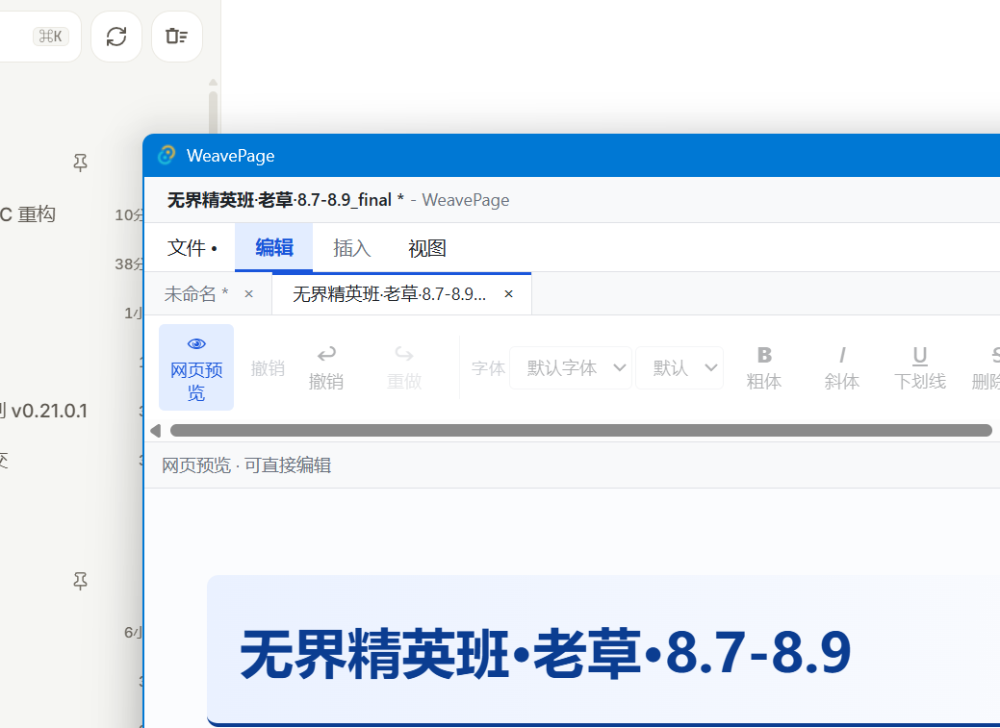
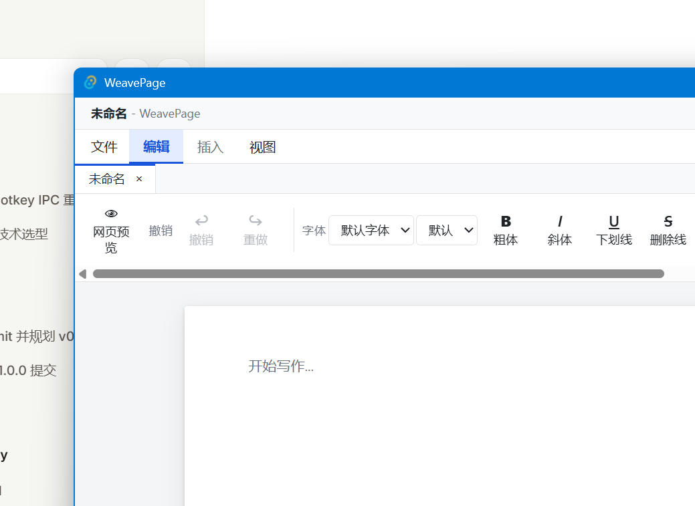

# WeavePage 织页

> 所见即所得的本地网页编辑器 — 像 Dreamweaver 一样「织」网页,但更轻、更简单、更现代。

WeavePage 是一款 Windows 桌面网页编辑器:打开任意 HTML 文件,立即呈现完整的 CSS 样式与 JS 动态效果;**编辑界面就是最终效果**。零配置、零学习成本,双击即装即用。

**开发者**:[aiec.fun](https://aiec.fun)

---

## 界面预览

| 编辑视图(所见即所得) | 网页预览(完整 CSS/JS 效果) |
|---|---|
|  |  |

| 主界面(Word 风格功能区 + 多标签页) |
|---|
|  |

---

## ✨ 核心特点

### 所见即所得,打开即见

- 打开 HTML 文件,**文档的 CSS 直接注入编辑区** — 标题样式、字体、颜色、排版与最终页面完全一致,边编辑边看到真实效果
- **网页预览模式**:完整渲染 CSS 样式与 JS 动态效果(目录悬浮、平滑滚动、交互组件),并且**可以直接在预览中编辑文字**,改动实时同步回编辑器
- 外部 CSS / JS / 图片**自动内联**为自包含文档,保存后重新打开效果不丢失

### 简单易上手,像 Word 一样编辑网页

- **Word 风格功能区**:字体、字号、颜色、高亮、对齐、列表、引用、代码块,按钮实时反映选中文字的实际格式
- **表格**:5×5 网格选择器一键插入,行列增删
- **图片**:本地图片以 base64 嵌入,所见即所得
- **多标签页**:同时打开多个 HTML / CSS / JS 文件,标签切换
- **源码视图**:查看 / 编辑完整页面代码(head、CSS、JS 全部可见),Ctrl+S 直接保存
- **块级源码编辑**:右键任意块 → 右侧边栏直接编辑该块的 HTML,可导航父块 / 子块 / 兄弟块
- **外联资源侧边栏**:网页引用的 CSS / JS 文件自动列出,点击即在新标签中打开编辑

### 轻量可靠

- 安装包自带 **WebView2 离线运行时** — 全新电脑、无网络环境双击安装直接使用
- 基于 Tauri,单进程低占用,启动秒开
- 主题三态(浅色 / 深色 / 跟随系统),页式 / 全宽视图,重启保持

## 📋 功能清单

| 分类 | 功能 |
|---|---|
| 文件 | 新建 / 打开 / 保存 / 另存为 / 导出网页 / 关闭(Ctrl+N / O / S / Shift+S / W) |
| 编辑 | 撤销 / 重做 / 剪贴板快捷键、字体 / 字号(9-36pt)/ 粗斜体 / 下划线 / 删除线 / 文字颜色 / 高亮 |
| 段落 | 左中右两端对齐、项目符号 / 编号 / 任务清单、缩进、引用、代码块 |
| 样式 | 正文、标题 H1-H4(打开文档支持 H1-H6) |
| 插入 | 表格(网格选择器 + 行列增删)、图片(base64)、水平线、链接 |
| 视图 | 编辑模式 / 源码视图 / 网页预览(可直接编辑)、页式(白纸)/ 全宽、主题三态、功能区折叠 |
| 多标签 | HTML / CSS / JS / 文本多文件标签页,独立状态,标签切换 |
| 块编辑 | 右键块 → 右侧边栏编辑该块 HTML 源码,块范围导航 |
| 外联资源 | 自动内联 CSS / JS / 图片,侧边栏列出可编辑 |

**快捷键**:`Ctrl+N/O/S/Shift+S/W` 文件操作、`F5` 刷新预览、`F9` 切换编辑/预览

## 🚀 安装

1. 前往 [Releases](https://github.com/kizemo/weavepage/releases) 下载最新版
2. 双击 `WeavePage_0.1.0_x64-setup.exe` 安装(自动安装 WebView2 运行时,全程无需联网)
3. 从开始菜单启动 **WeavePage**

**系统要求**:Windows 10/11 x64

## 📖 使用指南

### 打开文档

`文件 → 打开`(或 `Ctrl+O`)选择 HTML 文件 — 自动进入编辑视图,文档样式即时呈现。

### 编辑

直接在编辑区输入、修改,使用顶部功能区调整格式。选中文字时,功能区自动显示该文字的实际字体 / 字号 / 颜色。

### 预览

点功能区「👁 网页预览」按钮(或 `F9`)— 查看完整 CSS / JS 动态效果,可直接在预览中修改文字,改动自动同步。`F5` 将编辑器内容同步到预览。

### 源码编辑

- **整页源码**:`视图 → 源码视图`,head / CSS / JS 全部可见可编辑,`Ctrl+S` 保存
- **单块源码**:编辑区**右键**任意块 → 右侧面板编辑该块 HTML → 「应用」

### 外联资源

打开带外部 CSS / JS 的网页时,左侧自动出现「外联资源」侧边栏,点击文件即可在新标签编辑,`Ctrl+S` 保存回原文件。

### 多标签

`Ctrl+O` 打开新文件、`Ctrl+N` 新建、`Ctrl+W` 关闭当前标签,点击标签切换。

## 🛠 开发

```bash
# 环境:Node.js ≥ 20、Rust ≥ 1.77、pnpm
pnpm install          # 安装依赖
pnpm tauri dev        # 开发模式运行
pnpm build            # 前端构建(tsc + vite)
pnpm release          # 打包安装程序到 release/ 目录
```

## 🏗 技术栈

| 层 | 技术 |
|---|---|
| 桌面壳 | Tauri v2(Windows,WebView2) |
| 前端 | React 19 + TypeScript + Vite |
| 编辑器 | Tiptap 3(ProseMirror) |
| 包管理 | pnpm |

## 📁 项目结构

```
├── src/                    # React 前端
│   ├── App.tsx             # 应用装配(多标签/文件操作/模式切换/快捷键)
│   ├── App.css             # CSS 变量主题系统 + 功能区/编辑区样式
│   ├── extensions/         # 自定义扩展(字号/HTML 保真)
│   ├── utils/              # 字体常量表/HTML 格式化
│   └── components/         # 菜单栏/功能区/标签栏/侧边栏/状态栏/块源码面板
├── src-tauri/              # Tauri 壳(capabilities/图标/打包配置)
├── assets/                 # 示例文档与界面截图
└── scripts/                # 发布脚本(构建后复制安装包到 release/)
```

## 许可

© 2026 [aiec.fun](https://aiec.fun)
